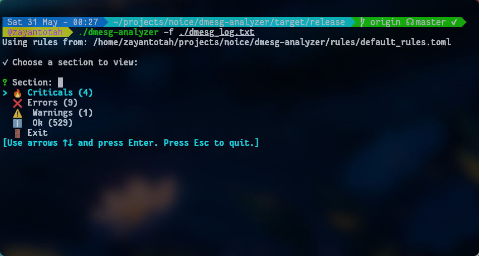

# dmesg-analyzer

[](https://www.rust-lang.org/) [](LICENSE)

Highlight and summarize Linux kernel `dmesg` logs with colors and rules, and interactively browse categorized log entries.

---

## Features

- **Categorizes dmesg output** into Critical, Error, Warning, and Info sections.
- **Customizable rules** for log classification and coloring via a TOML file.
- **Interactive terminal UI** for browsing log categories.
- **Supports both live dmesg and log files** as input.
- **Colorful, icon-enhanced output** for quick log scanning.

---

## Installation

1. **Clone the repository:**
   ```sh
   git clone https://github.com/yourusername/dmesg-analyzer.git
   cd dmesg-analyzer
   ```

2. **Build with Cargo:**
   ```sh
   cargo build --release
   ```

---

## Usage

### Analyze live kernel logs

```sh
cargo run --release
```

### Analyze a saved log file

```sh
cargo run --release -- --file path/to/dmesg.log
```

### Use a custom rules file

```sh
cargo run --release -- --rules path/to/your_rules.toml
```

---

## Rule Configuration

Rules are defined in TOML format. The default is at `rules/default_rules.toml`:

```toml
[error]
keywords = ["error", "fail", "unable"]
color = "red"
icon = "❌"

[warning]
keywords = ["warn", "deprecated", "overcurrent"]
color = "yellow"
icon = "⚠️"

[critical]
keywords = ["panic", "segfault", "oops"]
color = "bold red"
icon = "🔥"

[info]
keywords = ["usb", "initialized", "found"]
color = "green"
icon = "ℹ️"
```

- **keywords**: List of substrings to match in log lines.
- **color**: Output color (supported by the [`colored`](https://docs.rs/colored/) crate).
- **icon**: Unicode icon to prefix each line.

---

## Interactive UI

After parsing, you'll see a menu to select which category to view. Use arrow keys and Enter to select, or Esc to exit. Logs are shown in a colorized pager (`less -R`).

---

## Project Structure

- `src/main.rs` — CLI, main logic, and interactive menu.
- `src/parser.rs` — Log line classification.
- `src/formatter.rs` — Color and icon formatting.
- `src/rules.rs` — Rule loading and deserialization.
- `rules/default_rules.toml` — Example rules file.

---

## Dependencies

- [clap](https://crates.io/crates/clap) — CLI argument parsing
- [colored](https://crates.io/crates/colored) — Terminal colors
- [serde](https://crates.io/crates/serde), [toml](https://crates.io/crates/toml) — Rule file parsing
- [inquire](https://crates.io/crates/inquire) — Interactive selection
- [tempfile](https://crates.io/crates/tempfile) — Temporary file handling

---

## Contributing

Contributions are welcome! Please open issues or pull requests for bug fixes, features, or improvements. For major changes, please open an issue first to discuss what you would like to change.

1. Fork the repository
2. Create your feature branch (`git checkout -b feature/AmazingFeature`)
3. Commit your changes (`git commit -m 'Add some AmazingFeature'`)
4. Push to the branch (`git push origin feature/AmazingFeature`)
5. Open a pull request

---

## License

This project is licensed under the MIT License. See the [LICENSE](LICENSE) file for details.

---

## Acknowledgements

- Inspired by the need for better kernel log readability.
- Built with ❤️ in Rust. 